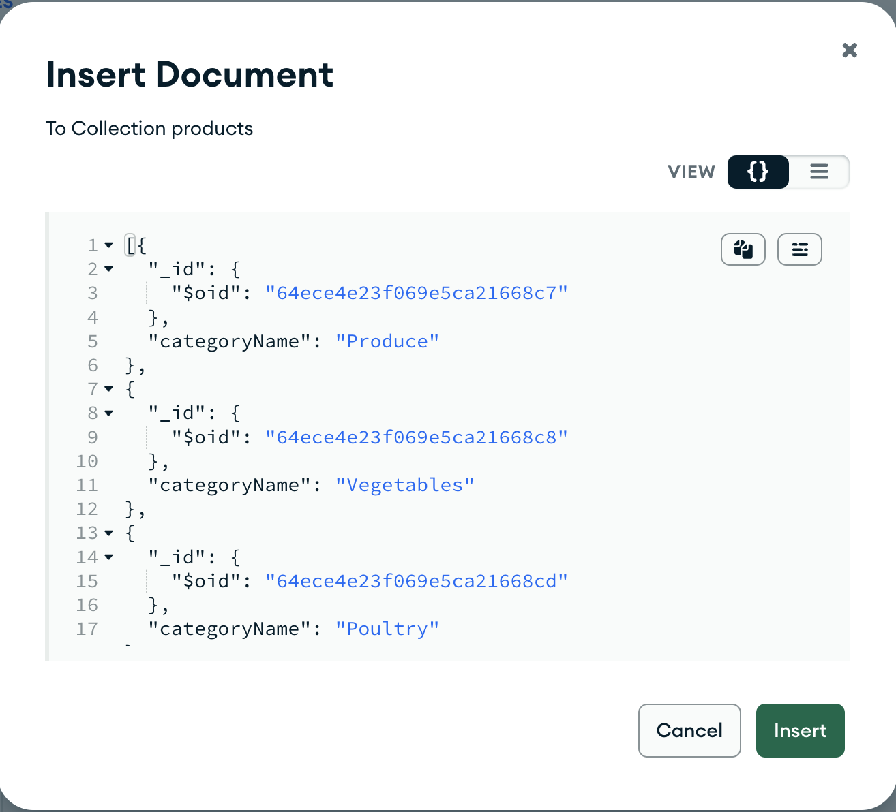

# 🛍️ AI-Shop Demo

Welcome to the AI-Shop demo! Dive into the synergy of [Atlas Vector Search](https://www.mongodb.com/products/platform/atlas-vector-search), [Langchain JS](https://js.langchain.com/docs/get_started/introduction), and OpenAI.

## 🌟 **Features**
- **Product Catalog**: Display of items.
- **AI Assistant**: Using LangChain and OpenAI, this assistant provides product suggestions based on varied inputs like recipes or ambiguous requests.

## 🚀 **Workflow**
1. Craft a prompt for LLM.
2. Format data and enhance with embeddings.
3. Produce MongoDB vector search aggregations to display relevant results.

## 🛠️ **Requirements**
- Atlas Project
- Atlas Cluster (free cluster works!)
- App Services Application (e.g., `AI-Shop`). Ensure linkage.
- OpenAI account with API access.
   
   
## 🔧 **Project Setup**
### **Step 1: Secrets and Values**
1. Navigate to your App Services application.
2. Under "Values", create a secret named `openAIKey` with your OPEN AI API key.

3. Create a linked value named `OpenAIKey` and link to the secret.

### **Step 2: Database Setup**
1. Create a Database trigger on `insert` for Open AI embeddings.
   - Database: `ai_shop`
   - Collection: `products`
### **Function: calcEmbeddings**

```javascript
exports = async function(changeEvent) {
    // Get the full document from the change event.
    const doc = changeEvent.fullDocument;

    // Define the OpenAI API url and key.
    const url = 'https://api.openai.com/v1/embeddings';
    // Use the name you gave the value of your API key in the “Values” utility inside of App Services
    const openai_key = context.values.get("openAIKey");

    try {
        console.log(`Processing document with id: ${JSON.stringify(doc)}`);
        

        // Call OpenAI API to get the embeddings.
        let response = await context.http.post({
            url: url,
             headers: {
                'Authorization': [`Bearer ${openai_key}`],
                'Content-Type': ['application/json']
            },
            body: JSON.stringify({
                input: `${doc.title} - ${doc.description}`,
                model: "text-embedding-ada-002"
            })
        });

        // Parse the JSON response
        let responseData = EJSON.parse(response.body.text());

        // Check the response status.
        if(response.statusCode === 200) {
            console.log("Successfully received embedding.");

            const embedding = responseData.data[0].embedding;

            // Get the cluster in MongoDB Atlas.
            const mongodb = context.services.get('mongodb-atlas');
            const db = mongodb.db('ai_shop'); // Replace with your database name.
            const collection = db.collection('products'); // Replace with your collection name.

            // Update the document in MongoDB.
            const result = await collection.updateOne(
                { _id: doc._id },
                // The name of the new field you’d like to contain your embeddings.
                { $set: { embeddings: embedding }}
            );

            if(result.modifiedCount === 1) {
                console.log("Successfully updated the document.");
                
                
            } else {
                console.log("Failed to update the document.");
            }
        } else {
            console.log(`Failed to receive embedding. Status code: ${response.body.text()}`);
        }

    } catch(err) {
        console.error(err);
    }
};
```
- Verify that the function runs under "SYSTEM" context after saving the trigger.

### Step 4 - Ingest Data and Create Vector index

### Ingest the data
 
We need to ingest the data under local directory `data`:
1. `data/ai_shop.categories.json` into collection named `categories` (hosting the possible categories in the shop).
1. `data/ai_shop.products.json` into collection named `products` (hosting the products in the shop).

We can use tools like `mongoimport` or compass to import those files. Or we can take the content and "copy" into "Data Explorer" > "INSERT DOCUMENT" tab:

Once data is ingested the trigger should set "embeddings" field under each product.

Create an Atlas Search index by going to the Cluster "Search" tab and specify a new index on:
- Database : `ai_shop`
- Collection : `products`
  
  

Use "JSON Editor" and specify a "defualt" index:
```
{
  "mappings": {
    "dynamic": true,
    "fields": {
      "embeddings": {
        "dimensions": 1536,
        "similarity": "cosine",
        "type": "knnVector"
      }
    }
  }
}
```

Create the index and make sure it is "Active".


### Step 5 - Setup application

Create .env file in the main directory with the following content:
```
OPEN_AI_KEY='<OPEN_AI_KEY>'
DB_URL='<ATLAS_CONNECTION_URI>'
```
- The database user must have read/write permissions on `ai_shop` database.
### Install the application

```sh
npm install
```

### Step 6 - Run application

### Start the backend

```sh
npm run server
```

### Start fronend

```sh
npm run dev
```

Go to the suggested vite url to browse application:


## 🛑 Disclaimer 🛑
Use at your own risk. Not an official MongoDB product.


